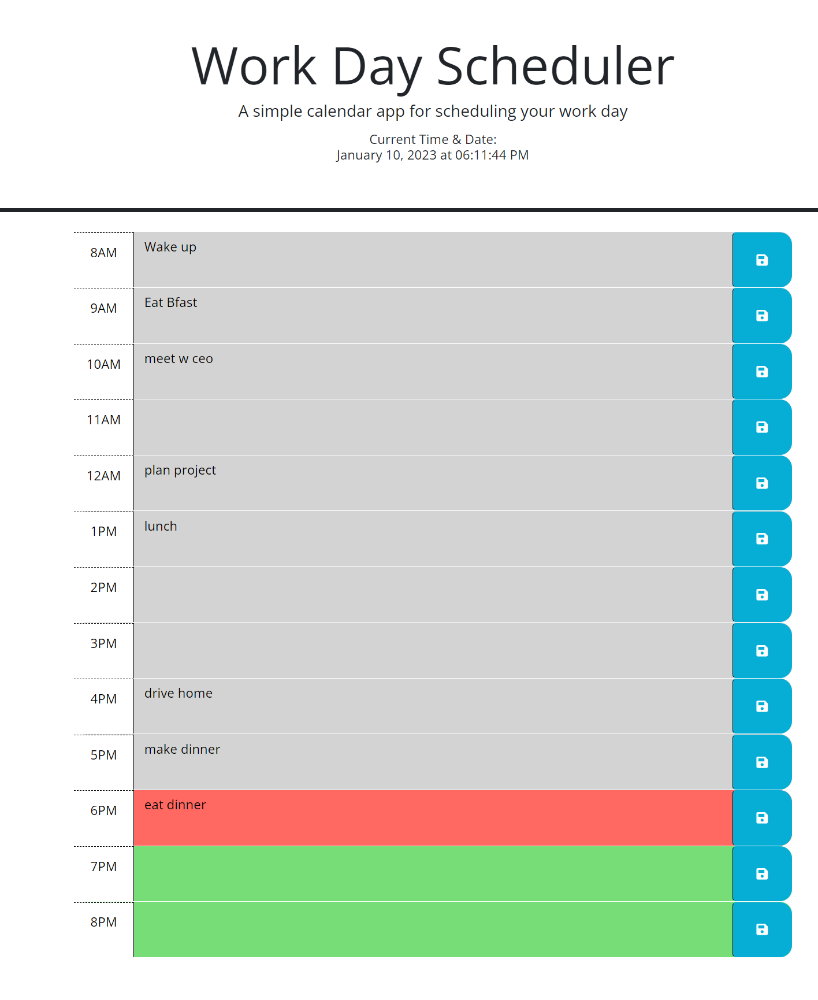

# bootcamp-challenge5-scheduler
UT Austin coding bootcamp scheduler

## Description

The following website is a Work Day Scheduler. Users will be able to add appointments in hourly time block and save them to local storage. Upon the page loading it will populate previously entered appointments from local storage as well as color code timeblocks to indicate past, present, and future timeblocks. 

## Installation

N/A

## Usage

Go to the following URL:
https://airen22.github.io/Bootcamp-Challenge5-Scheduler/

The following image shows a screenshot of the website: 

## Credits

Karen Peazzoni: https://github.com/kpeazzoni/

## License

Please refer to the LICENSE in the repo.
